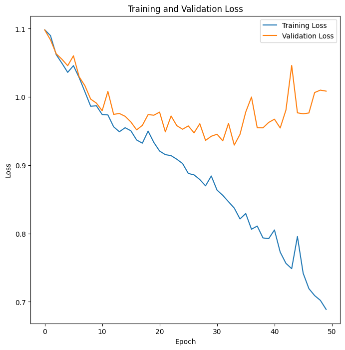
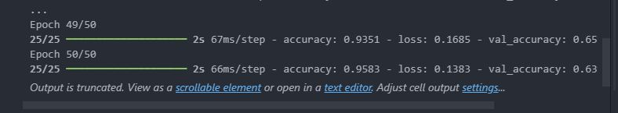
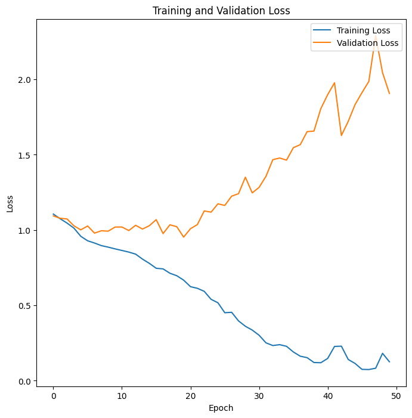
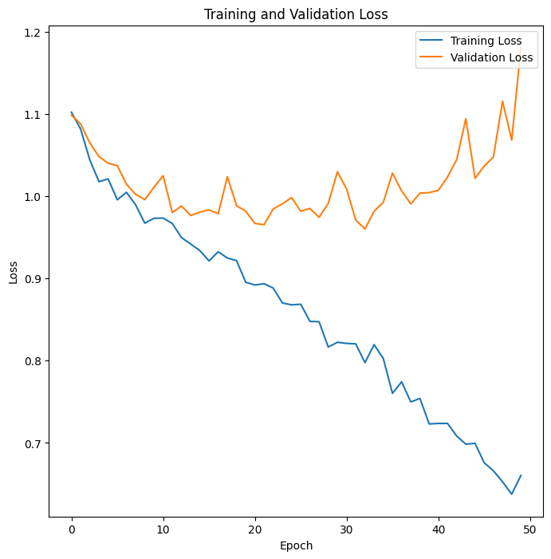
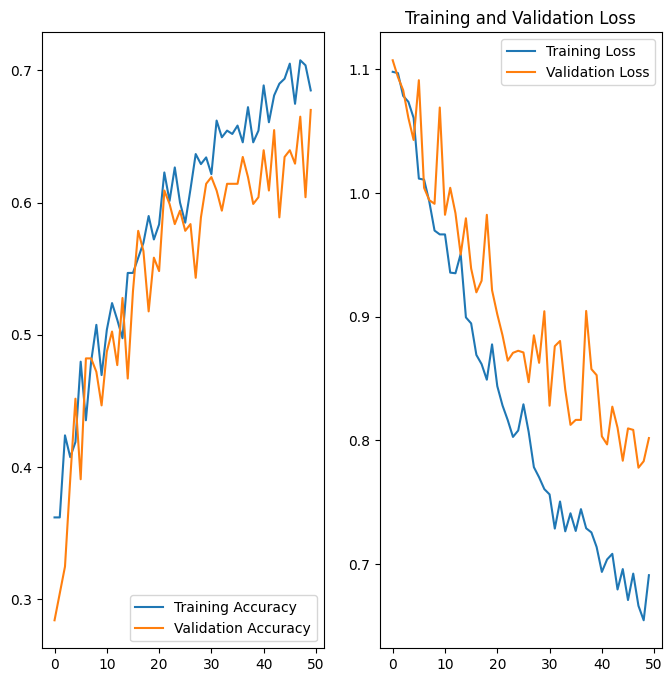
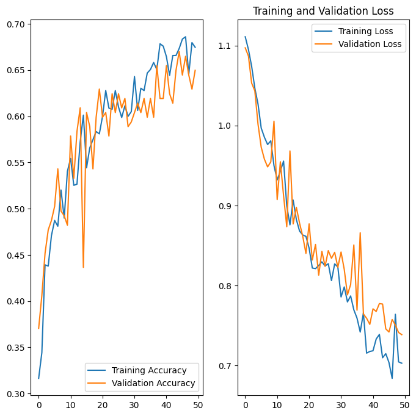

### Notes

- Use the Demo notebook results as my baseline model when comparing results with my experiments in model
- Study keras docs
- Experiment on using other preprocessing methods for images
- Experiment on adding MaxPooling2D every after Conv2D layers
- Experiment on changing the number of filters
- Experiment on changing the kernel size
- Experiment on changing the learning rate
- Experiment on changing the optimizers such as using SGD

applying AUTOTUNE results to 1m 16.8s

- accuracy: 0.6195 - loss: 0.7926 - val_accuracy: 0.5381 - val_loss: 0.9130

not applying AUTOTUNE results to 1m 57.1s

- accuracy: 0.5259 - loss: 0.9463 - val_accuracy: 0.4619 - val_loss: 1.0126

adding maxpooling2d sa bawat convolution blocks

- accuracy: 0.7662 - loss: 0.5157 - val_accuracy: 0.5635 - val_loss: 1.0746

increasing the filters from 4 to 16 gets these results

- 
- but it overfits
- 

adding dropout layers in each convolution blocks

- accuracy: 0.6818 - loss: 0.6504 - val_accuracy: 0.5533 - val_loss: 1.1810
- 

changing kernel size to 3 in each convolution blocks

- accuracy: 0.6909 - loss: 0.6943 - val_accuracy: 0.6701 - val_loss: 0.8019
- 

changing seed to 132

- accuracy: 0.6717 - loss: 0.7149 - val_accuracy: 0.6497 - val_loss: 0.7385
- 
